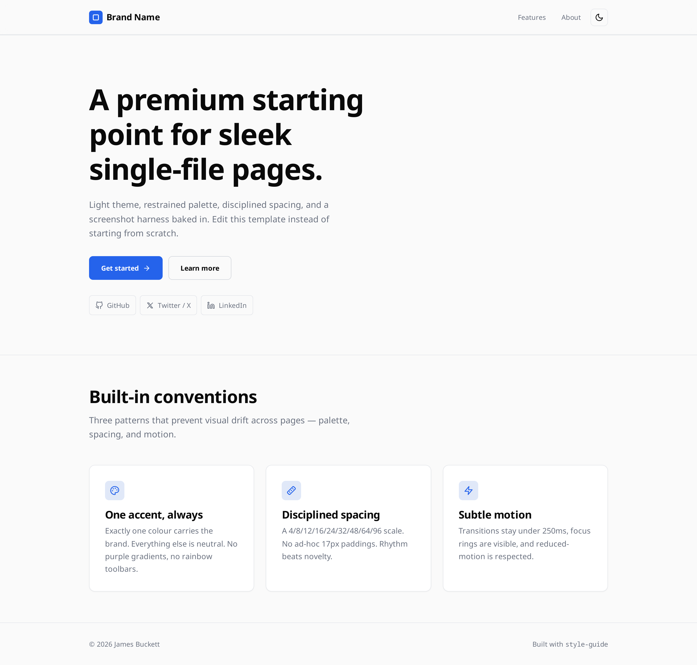

[](LICENSE)
[](https://docs.claude.com/en/docs/claude-code/skills)
[](https://nodejs.org)
[](https://playwright.dev)

# style-guide



**TL;DR** — A Claude Code skill that turns a one-line request ("build me a landing page") into a single-file, light-themed, design-disciplined `index.html`, then validates it visually with a Playwright screenshot harness across mobile, tablet, and desktop. Install it project-locally or globally, then ask Claude for a page.

> The image above is the bundled starter template (`.claude/skills/style-guide/assets/index.html`) rendered by the skill's own screenshot harness at 1440×900. Mobile and tablet captures: [`docs/hero-mobile.png`](docs/hero-mobile.png), [`docs/hero-tablet.png`](docs/hero-tablet.png).

## What this repo contains

The repo is two things in one tree:

**The skill itself** — `.claude/skills/style-guide/`
- `SKILL.md` — the design rules and workflow Claude follows
- `assets/index.html` — the compliant starter template Claude copies for every new page
- `references/lucide-icons.md` — pre-fetched Lucide SVG snippets ready to paste
- `scripts/screenshot.mjs` — the Playwright capture harness bundled with the skill
- `evals/evals.json` — the prompt set used during authoring to grade the skill

**A working project root** that mirrors what a consumer would have
- `screenshot.mjs` — same harness, copied to the root so it runs on the project's own `index.html`
- `.gitignore` — excludes `screenshots/`, `node_modules/`, and skill-eval workspaces

## What the skill enforces

| Area | Rule |
|---|---|
| Output | One self-contained `.html` file. No external CSS / JS, no build step |
| Theme | Light by default, dark mode opt-in via header toggle persisting to `localStorage` |
| Palette | Six CSS variables; exactly **one** brand accent; semantic state colours (`--state-ok/warn/bad`) are separate |
| Typography | Noto Sans (body, 18px) + Noto Sans Mono (code, 14px); `clamp()` hero scaling |
| Spacing | Token scale only — 4 / 8 / 12 / 16 / 24 / 32 / 48 / 64 / 96 px |
| Icons | Lucide SVG inlined directly. No icon fonts, no CDN script, no emoji |
| Branding | GitHub + X + LinkedIn icon row present on every page |
| Validation | Mandatory three-viewport screenshot pass (375 / 768 / 1440) before reporting done |

Full rules in [`.claude/skills/style-guide/SKILL.md`](.claude/skills/style-guide/SKILL.md).

## Installing the skill

Claude Code discovers skills from two locations. Pick one based on whether you want the skill in a single project or available everywhere.

### Option A — Project-scoped (recommended for trying it out)

Drops the skill into the current repo only. Other Claude Code sessions are unaffected.

```bash
# From the root of the project where you want the skill
mkdir -p .claude/skills
git clone https://github.com/jamesbuckett/style-guide.git /tmp/style-guide
cp -r /tmp/style-guide/.claude/skills/style-guide .claude/skills/style-guide
rm -rf /tmp/style-guide
```

Verify it loaded:

```bash
ls .claude/skills/style-guide/SKILL.md
```

Open Claude Code in that directory. The skill appears in the available-skills list automatically.

### Option B — User-scoped (available in every project)

Installs to your home directory so every Claude Code session can use it.

```bash
mkdir -p ~/.claude/skills
git clone https://github.com/jamesbuckett/style-guide.git /tmp/style-guide
cp -r /tmp/style-guide/.claude/skills/style-guide ~/.claude/skills/style-guide
rm -rf /tmp/style-guide
```

Verify:

```bash
ls ~/.claude/skills/style-guide/SKILL.md
```

### Option C — Symlink for development

If you want to edit the skill and have changes pick up immediately:

```bash
git clone https://github.com/jamesbuckett/style-guide.git ~/code/style-guide
mkdir -p ~/.claude/skills
ln -s ~/code/style-guide/.claude/skills/style-guide ~/.claude/skills/style-guide
```

## Project setup for the screenshot harness

The skill's screenshot loop needs Playwright + a Chromium binary. Run this **once per project** that consumes the skill (it's already set up in this repo via `.gitignore`):

```bash
# Inside the project where Claude will be generating index.html
cp ~/.claude/skills/style-guide/scripts/screenshot.mjs ./
npm init -y
npm install --save-dev playwright
npx playwright install chromium
```

Then the harness runs as:

```bash
node screenshot.mjs ./index.html
```

Output lands in `./screenshots/` as `mobile.png`, `tablet.png`, `desktop.png`. The harness auto-slices tall pages to stay under Chrome's canvas limit.

## Using the skill

Once installed, you don't need to name it — its description triggers on prompts like:

- "Build a landing page for X"
- "Make a single-file HTML mockup of Y"
- "Edit `index.html` to add a feature comparison"

Claude will copy the starter template, customise it, run the screenshot harness, view the captures, critique, and iterate up to three cycles. Skip explicitly only when you want a multi-file framework build (React, Vue, Next, etc.).

## Requirements

| Component | Version | Notes |
|---|---|---|
| Claude Code | latest | Skills are read on session start |
| Node.js | ≥ 18 | For running `screenshot.mjs` |
| Playwright | latest | Installed as a dev dependency in each consuming project |
| Chrome or Chromium | any recent | Harness prefers system Chrome, falls back to bundled Chromium |

## Repository layout

```
style-guide/
├── .claude/
│   └── skills/
│       └── style-guide/
│           ├── SKILL.md
│           ├── assets/index.html
│           ├── references/lucide-icons.md
│           ├── scripts/screenshot.mjs
│           └── evals/evals.json
├── screenshot.mjs              # root-level copy for this repo's own pages
├── .gitignore
└── README.md
```

## License

MIT — see [`LICENSE`](LICENSE).
